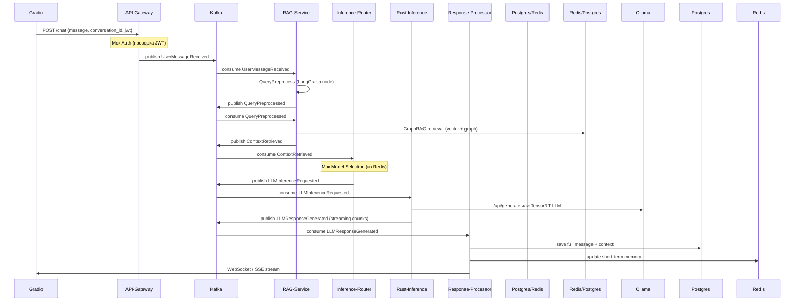

**Цепочка 3 (Core Chat Inference Chain)**  
**Название:** `user-message-processing`  
**Цель:** Обработка одного сообщения пользователя → Graph RAG → выбор LLM → инференс → сохранение ответа.  
**Независимость:** Эта цепочка **полностью автономна**. Она может запускаться/останавливаться/масштабироваться отдельно от Auth, Model Management и Conversation CRUD. Все внешние зависимости (авторизация, выбор модели, сессия) заменяются **моками** для изолированного тестирования.

### 1. Микросервисы, участвующие в цепочке

| Тип          | Название сервиса                  | Язык / Фреймворк          | Роль в цепочке                              | Из коробки / Самописный |
|--------------|-----------------------------------|---------------------------|---------------------------------------------|--------------------------|
| Frontend     | **gradio-frontend**               | Gradio + FastAPI          | UI + отправка сообщения                     | Самописный (тонкий)     |
| Gateway      | **api-gateway**                   | FastAPI                   | Приём HTTP → Kafka, JWT-мок                 | Самописный              |
| RAG          | **rag-service**                   | Python + LangGraph        | Preprocess + GraphRAG retrieval             | Самописный              |
| Inference    | **inference-router**              | Python + LangGraph        | Выбор модели + маршрутизация                | Самописный              |
| Heavy compute| **rust-inference**                | Rust (Actix / Axum)       | Реальный инференс (Ollama wrapper + TensorRT-LLM fallback) | Самописный (Rust) |
| Post-process | **response-processor**            | Python                    | Пост-обработка, streaming, сохранение       | Самописный              |
| **Shared**   | **kafka**                         | Kafka + Zookeeper / KRaft | Event bus                                   | Из коробки              |
| **Shared**   | **postgres**                      | PostgreSQL + pgvector     | Строгое хранение сообщений и graph-сущностей | Из коробки            |
| **Shared**   | **redis**                         | Redis Stack (RediSearch + vector) | Кэш короткой истории + vector index     | Из коробки              |
| **Shared**   | **ollama**                        | Ollama                    | Локальные LLM (fallback)                    | Из коробки              |
| **Observability** | **otel-collector + jaeger + prometheus + grafana** | —                   | Трассировка и метрики                       | Из коробки              |

### 2. Полная цепочка прохода запроса (событийный поток)



**Детализация каждого шага с событиями:**

| № | Сервис               | Триггер-событие                  | Действие внутри сервиса                              | Событие, которое публикуется                  |
|---|----------------------|----------------------------------|------------------------------------------------------|-----------------------------------------------|
| 1 | api-gateway          | HTTP POST /chat                  | Мок JWT → correlation_id → валидация rate-limit     | `UserMessageReceived`                         |
| 2 | rag-service          | `UserMessageReceived`            | LangGraph: rewrite query + safety check              | `QueryPreprocessed`                           |
| 3 | rag-service          | `QueryPreprocessed`              | GraphRAG: vector search (Redis) + graph traversal (pgvector/Neo4j) | `ContextRetrieved` (с metadata)             |
| 4 | inference-router     | `ContextRetrieved`               | Мок "выбор модели" + проверка доступности           | `LLMInferenceRequested` (model + prompt)      |
| 5 | rust-inference       | `LLMInferenceRequested`          | Rust → Ollama/TensorRT-LLM, streaming chunks        | `LLMResponseChunkGenerated` (много раз) + `LLMResponseGenerated` |
| 6 | response-processor   | `LLMResponseGenerated`           | Пост-обработка + сохранение + обновление сессии     | `MessageProcessed` (опционально)              |

### 3. Моковые заглушки для изолированного тестирования

Чтобы цепочка запускалась **без** других цепочек:

- **Мок Auth** (в api-gateway):  
  ```python
  # mock_auth.py
  def validate_jwt(token: str) -> dict:
      return {"user_id": "mock-123", "nickname": "testuser"}  # всегда валидный
  ```

- **Мок Model Selection** (в inference-router):  
  Читает из Redis ключ `mock:conversation:{conversation_id}:model` (заранее можно положить `llama3.2` или `qwen2.5`).

- **Мок Conversation Service**:  
  При старте цепочки в Redis создаётся запись:
  ```redis
  SET mock:conversation:conv-abc {"model": "llama3.2", "graph_rag_enabled": true}
  ```

- Для локального теста можно запустить **только** сервисы:
  `api-gateway + rag-service + inference-router + rust-inference + response-processor + kafka + postgres + redis + ollama`

### 4. Как построить и запустить цепочку

#### A. Docker Compose (для локальной разработки / MVP)

Создай отдельный файл `docker-compose.chat.yml`:

```yaml
services:
  api-gateway:
    build: ./services/api-gateway
    ports: ["8000:8000"]
    depends_on: [kafka]
    environment:
      - KAFKA_BOOTSTRAP= kafka:9092
      - MOCK_AUTH=true

  rag-service:
    build: ./services/rag-service
    depends_on: [kafka, postgres, redis]
    environment:
      - KAFKA_BOOTSTRAP= kafka:9092
      - VECTOR_DB=redis

  inference-router:
    build: ./services/inference-router

  rust-inference:
    build: ./services/rust-inference
    ports: ["8081:8081"]
    deploy:
      resources:
        reservations:
          devices:
            - driver: nvidia

  response-processor:
    build: ./services/response-processor

  # shared (можно вынести в основной docker-compose.yml)
  kafka:
    image: confluentinc/cp-kafka:7.6.0
  postgres:
    image: postgres:16-alpine
    volumes: ["pgdata:/var/lib/postgresql/data"]
  redis:
    image: redis/redis-stack:latest
  ollama:
    image: ollama/ollama
    volumes: ["ollama:/root/.ollama"]
```

Запуск только этой цепочки:
```bash
docker compose -f docker-compose.chat.yml -f docker-compose.shared.yml up --build api-gateway rag-service inference-router rust-inference response-processor
```

#### B. Kubernetes (production-ready)

Используй **один Helm-чарт** `chat-inference` или отдельные Deployment'ы с лейблами:

```yaml
# deployment.yaml (пример для rag-service)
apiVersion: apps/v1
kind: Deployment
metadata:
  name: rag-service
  labels:
    chain: user-message-processing
    app: rag-service
spec:
  replicas: 3
  selector:
    matchLabels:
      chain: user-message-processing
  template:
    metadata:
      labels:
        chain: user-message-processing
      annotations:
        prometheus.io/scrape: "true"
    spec:
      containers:
      - name: rag-service
        image: yourrepo/rag-service:latest
        env:
        - name: KAFKA_BOOTSTRAP
          value: kafka-headless:9092
        - name: OTEL_EXPORTER_OTLP_ENDPOINT
          value: http://otel-collector:4317
```

**Helm values** для быстрого деплоя всей цепочки:
```yaml
chains:
  user-message-processing:
    enabled: true
    services:
      - api-gateway
      - rag-service
      - inference-router
      - rust-inference
      - response-processor
    replicas: 2
    resources:
      rust-inference:
        gpu: 1
```

Команда деплоя:
```bash
helm upgrade --install chat-inference ./helm/chat-inference --set chain=user-message-processing
```

